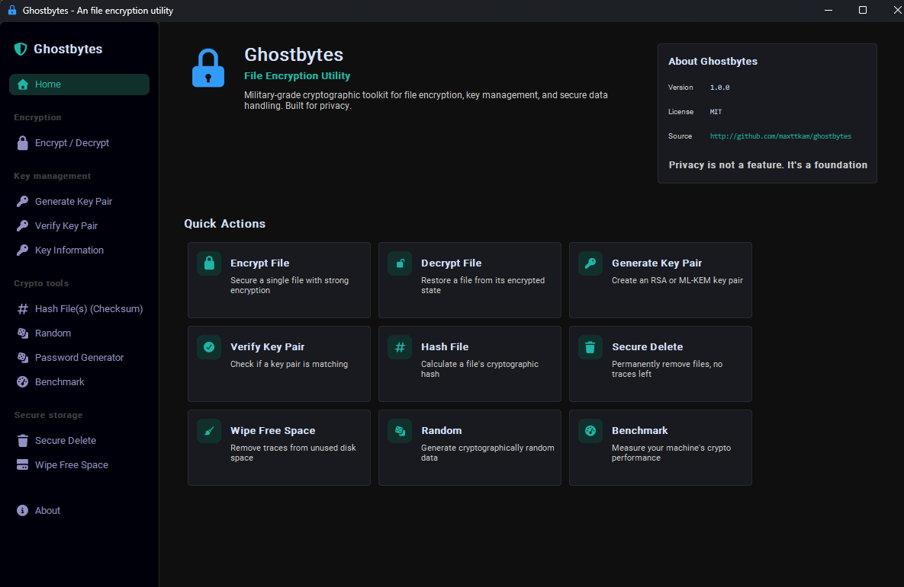

# GhostBytes

Ghostbytes is a desktop-based user-friendly file encryption and data security utility implmented in python.
It features symmetrical, asymmetrical (public / private key), and post-quantum cryptography designs through an intuitive graphical user interface (GUI).



## Aim

The goal of this project is to introduce everyday users and beginner developers to the fundamentals of **cryptography**, **data privacy**, **confidentiality in file sharing**.

In today's digital world, privacy isn't just for tech experts. it’s something everyone deserves. This repository aims to break down complex security concepts into simple, practical examples so anyone (even if you just learned your first lines of Python!) can understand how online privacy works and why it matters.

## Features

Ghostbytes implemented a range of security features ranging from encryption, key management, hashing, to cryptographical randomness and secure deletion. Core features of the program is listed below:

- **🔒 AES-256 GCM Mode Encryption with Authentication Tag (Integrity and Confidentiality)**: Encrypt files while providing integrity verification and authenticated encryption.
- **🔒 RSA Asymmetric Encryption / ML-KEM Post-Quantum Cryptography**: The _Module-Lattice-Based Key-Encapsulation Mechanism_ is implemented as one of the asymmetric encryption options along with RSA.
- **🔒 Envelope-Based Asymmetric Encryption**: Plaintext is encrypted using AES-256-GCM with a symmetric master key, which is then encapsulated and protected using asymmetric encryption to eliminate the message-size limitations of direct asymmetric encryption. (See [docs/cryptography.md](docs/cryptography.md) for more details)
- **🔑 Generate, Verify, and View RSA / ML-KEM / ML-DSA Keys**: Encryption keys and post-quantum signature keys can be generated, inspected, and verified within the program.
- **✍️ RSA-PSS and ML-DSA Signatures**: Create and verify detached signatures for files using RSA or ML-DSA. ML-DSA-44, ML-DSA-65, and ML-DSA-87 are supported.
- **# Fully-Featured Hashing Toolkit**: Major hashing algorithms (`SHA256`, `SHA512`, `SHA3_256`, `SHA3_512`, `BLAKE2b`, `BLAKE2s`, and `md5`) are implemented with an extension feature to copy output to checksum file.
- **🎲 Random Number Generator (with multiple random sources)**: Ghostbytes also features a function to generate passwords and random data from multiple random sources.
- **🗑️ Secure Delete (File Shredding)**: Secure delete or file shredding is implemented with multiple overwrite patterns (including `random`, `zero`, `one`, and `gutmann`)

## Supported / Used Algorithms

| Name                | Description                                                                                                                          | Library                                                            | Implementation                                                                                                                                                                                                              |
| ------------------- | ------------------------------------------------------------------------------------------------------------------------------------ | ------------------------------------------------------------------ | --------------------------------------------------------------------------------------------------------------------------------------------------------------------------------------------------------------------------- |
| AES-256-GCM         | Authenticated symmetric encryption providing confidentiality and integrity verification.                                             | PyCryptodome (`Crypto.Cipher.AES`)                                 | Implemented by `aes_encrypt()` and `aes_decrypt()` in [primitives.py](src/ghostbytes/crypto/primitives.py#L31). A 32-byte key is used for AES-256, with the nonce and authentication tag stored in the ciphertext envelope. |
| RSA-OAEP            | Asymmetric encryption using an RSA public key for encryption and private key for decryption.                                         | PyCryptodome (`Crypto.Cipher.PKCS1_OAEP`, `Crypto.PublicKey.RSA`)  | Implemented by `rsa_oaep_encrypt()` and `rsa_oaep_decrypt()` in [primitives.py](src/ghostbytes/crypto/primitives.py#L133).                                                                                                  |
| Hybrid RSA-OAEP     | Encrypts file data with AES-256-GCM and protects the AES key using RSA-OAEP, avoiding RSA message-size limitations.                  | PyCryptodome and Argon2id                                          | Implemented in [oaep_extension.py](src/ghostbytes/crypto/oaep_extension.py#L18). A random 32-byte seed is generated for each message, derived into an AES-256 key with Argon2id, and wrapped with RSA-OAEP.                 |
| ML-KEM-768          | Post-quantum key-encapsulation mechanism offering NIST Security Category 3 protection.                                               | `cryptography` (`cryptography.hazmat.primitives.asymmetric.mlkem`) | Key generation, encapsulation, decapsulation, and hybrid AES encryption are implemented in [kyber.py](src/ghostbytes/crypto/kyber.py#L31).                                                                                  |
| ML-KEM-1024         | Post-quantum key-encapsulation mechanism offering NIST Security Category 5 protection.                                               | `cryptography`                                                     | Supported alongside ML-KEM-768 through the algorithm mapping in [kyber.py](src/ghostbytes/crypto/kyber.py#L212).                                                                                                            |
| RSA-PSS             | RSA probabilistic digital signature scheme for detached signatures.                                                                  | PyCryptodome (`Crypto.Signature.pss`)                              | Implemented by `rsa_sign()` and `rsa_verify()` in [primitives.py](src/ghostbytes/crypto/primitives.py).                                                                                                                     |
| ML-DSA-44 / 65 / 87 | Post-quantum digital signature algorithm standardized by FIPS 204.                                                                   | `cryptography` (`cryptography.hazmat.primitives.asymmetric.mldsa`) | Key generation, signing, verification, and serialization are implemented in [dilithium.py](src/ghostbytes/crypto/dilithium.py).                                                                                             |
| Argon2id            | Memory-hard password-based key derivation function used to derive 256-bit encryption keys.                                           | `argon2-cffi` (`argon2.low_level`)                                 | Implemented by `derive_key()` in [primitives.py](src/ghostbytes/crypto/primitives.py#L205), using configurable salt, time cost, memory cost, and parallelism.                                                               |
| SHA-256             | Secure cryptographic hash function producing a 256-bit digest.                                                                       | PyCryptodome (`Crypto.Hash.SHA256`)                                | Registered in [config.py](src/ghostbytes/crypto/config.py#L13) and used by the file hashing and benchmarking tools.                                                                                                         |
| SHA-512             | Secure cryptographic hash function producing a 512-bit digest.                                                                       | PyCryptodome (`Crypto.Hash.SHA512`)                                | Registered in [config.py](src/ghostbytes/crypto/config.py#L13) and used by the file hashing and benchmarking tools.                                                                                                         |
| SHA3-256            | SHA-3 cryptographic hash function producing a 256-bit digest.                                                                        | PyCryptodome (`Crypto.Hash.SHA3_256`)                              | Registered in [config.py](src/ghostbytes/crypto/config.py#L13).                                                                                                                                                             |
| SHA3-512            | SHA-3 cryptographic hash function producing a 512-bit digest.                                                                        | PyCryptodome (`Crypto.Hash.SHA3_512`)                              | Registered in [config.py](src/ghostbytes/crypto/config.py#L13).                                                                                                                                                             |
| BLAKE2b             | High-performance cryptographic hash function optimized for 64-bit platforms.                                                         | PyCryptodome (`Crypto.Hash.BLAKE2b`)                               | Registered in [config.py](src/ghostbytes/crypto/config.py#L13).                                                                                                                                                             |
| BLAKE2s             | BLAKE2 hash function optimized for smaller platforms and 32-bit systems.                                                             | PyCryptodome (`Crypto.Hash.BLAKE2s`)                               | Registered in [config.py](src/ghostbytes/crypto/config.py#L13).                                                                                                                                                             |
| MD5                 | Legacy 128-bit hash function provided for compatibility and checksums. It is not suitable for security-sensitive integrity purposes. | Python standard library (`hashlib`)                                | Imported and registered in [config.py](src/ghostbytes/crypto/config.py#L12).                                                                                                                                                |
| `os.urandom`        | Operating-system random byte generator.                                                                                              | Python standard library (`os`)                                     | Implemented in [rand.py](src/ghostbytes/tools/rand.py#L43).                                                                                                                                                                 |
| PyCryptodome random | Random byte generator provided by PyCryptodome.                                                                                      | PyCryptodome (`Crypto.Random`)                                     | Implemented using `get_random_bytes()` in [rand.py](src/ghostbytes/tools/rand.py#L45).                                                                                                                                      |
| Python `secrets`    | Cryptographically secure random byte generator intended for security-sensitive data.                                                 | Python standard library (`secrets`)                                | Implemented using `token_bytes()` in [rand.py](src/ghostbytes/tools/rand.py#L47).                                                                                                                                           |
| Python random       | General-purpose pseudo-random byte generator.                                                                                        | Python standard library (`random`)                                 | Implemented using `randbytes()` in [rand.py](src/ghostbytes/tools/rand.py#L49). This should not be used where cryptographic security is required.                                                                           |
| `/dev/urandom`      | Unix operating-system random byte device that does not block waiting for additional entropy.                                         | Unix device accessed through Python `subprocess`                   | Read through the `head` command in [rand.py](src/ghostbytes/tools/rand.py#L51).                                                                                                                                             |
| `/dev/random`       | Unix operating-system random byte device that may block while collecting entropy.                                                    | Unix device accessed through Python `subprocess`                   | Read through the `head` command in [rand.py](src/ghostbytes/tools/rand.py#L57).                                                                                                                                             |
| Random overwrite    | Overwrites file contents with random data.                                                                                           | Ghostbytes implementation using configured random sources          | Implemented by `overwrite_random()` in [shred.py](src/ghostbytes/tools/shred.py#L148).                                                                                                                                      |
| Zero overwrite      | Overwrites file contents with zero bytes.                                                                                            | Ghostbytes implementation                                          | Implemented by `overwrite_pattern()` and selected through `shred_file()` in [shred.py](src/ghostbytes/tools/shred.py#L44).                                                                                                  |
| One overwrite       | Overwrites file contents with `0xFF` bytes.                                                                                          | Ghostbytes implementation                                          | Implemented by `overwrite_pattern()` and selected through `shred_file()` in [shred.py](src/ghostbytes/tools/shred.py#L44).                                                                                                  |
| Gutmann overwrite   | Uses the traditional multi-pass Gutmann overwrite pattern.                                                                           | Ghostbytes implementation                                          | The 32-pass pattern is defined by `GUTMANN_PATTERN` and applied by `overwrite_gutmann()` in [shred.py](src/ghostbytes/tools/shred.py#L27).                                                                                  |

## Requirements

This project uses `Uv` as the main python package and project manager. In `Uv`, you can install the project dependencies via the following command:

```bash
uv sync
```

To run code instantly, use this command instead (it automatically triggers a sync before running the code):

```bash
uv run ghostbytes
```

## Quick Start / Installation

1. **Install uv (either in a virtual environment or globally on your system)** (if you haven't already):

```bash
pip install uv
```

2. **Clone the repository**:

```bash
git clone https://github.com/maxttkam/ghostbytes.git
```

3. **Sync the project dependencies**:

```bash
uv sync
```

For development, use:

```bash
uv sync --group dev
```

4. **Run code directly**:

```bash
uv run ghostbytes
```

5. **(optional) Install and configure PATH environment variable**:

```bash
uv tool install
uv tool update-shell
```

## Security Notes

GhostBytes uses established cryptographic primitives, but correct security depends on configuration, key handling, and operational practices.

Important Considerations:

- **The encryptor and decryptor must use the same configuration, including the salt, for decryption to succeed.**
- **Hybrid RSA-OAEP also depends on the matching KDF settings** (`kdf_salt`, time cost, memory cost, and parallelism), because the random AES key seed is derived with Argon2id before it is wrapped with RSA-OAEP.
- Use a preferably **unique salt** (in advanced settings) for each encryption (if applicable) and keep it with the encrypted data or configuration. Unique salts make precomputed rainbow table attacks more difficult.
- Configuration can be exported to and imported from a `.conf` file. Use **Generate Config (Random Salt)** to automatically create a salt from random bytes, then export the configuration so the same settings can be used by the encryptor and decryptor.
- Protect passwords, private keys, and configuration files from unauthorized access.
- Keep backups of important private keys and recovery information.
- Sensitive data, passwords, or keys may be exposed by malware, debugging tools, or memory extraction.
- Use trusted devices and secure environments when handling sensitive information.

### Limitations

- RSA key generation above 4096 bits may take significant time due to expensive prime generation operations.
- Python runtime overhead can make CPU-intensive cryptographic operations slower than equivalent lower-level implementations.
- Performance varies depending on hardware and cryptographic backend.

For operations that require speed (if you are a professional and you know what you are doing), consider the following alternatives instead:

[VeraCrypt](https://github.com/veracrypt/VeraCrypt)

[OpenSSL](https://github.com/openssl/openssl)
