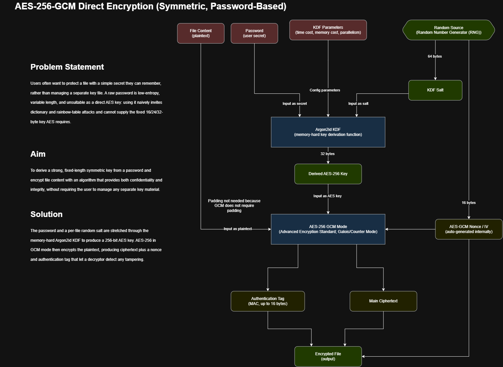
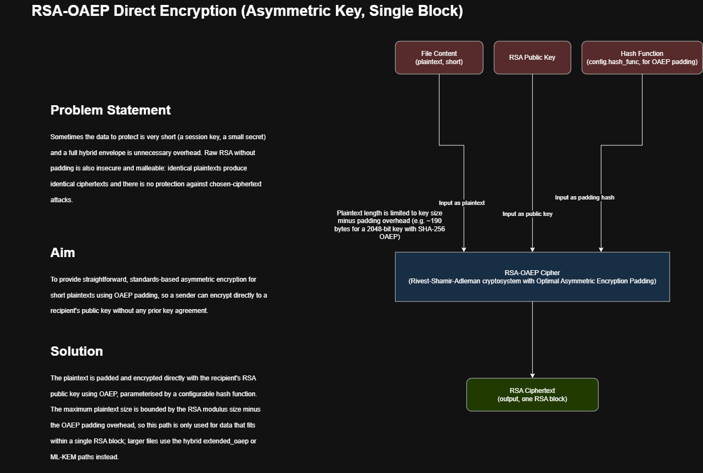
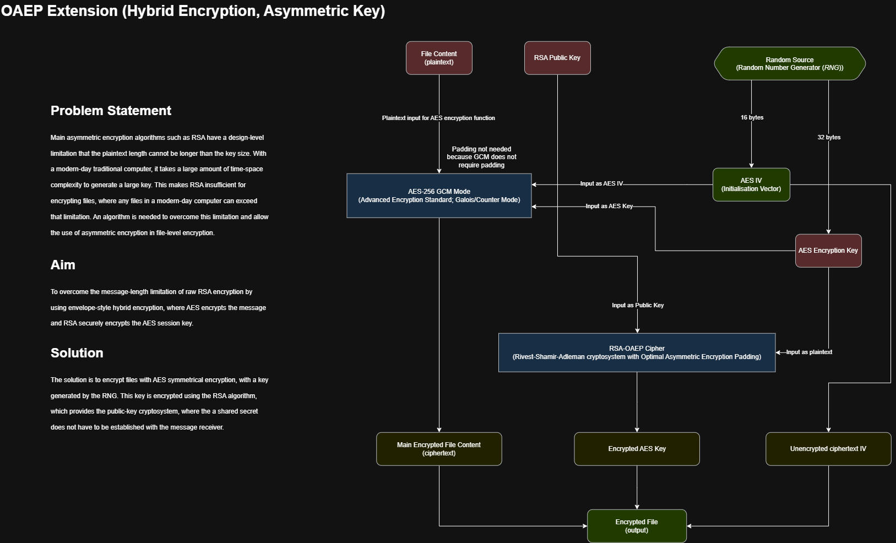
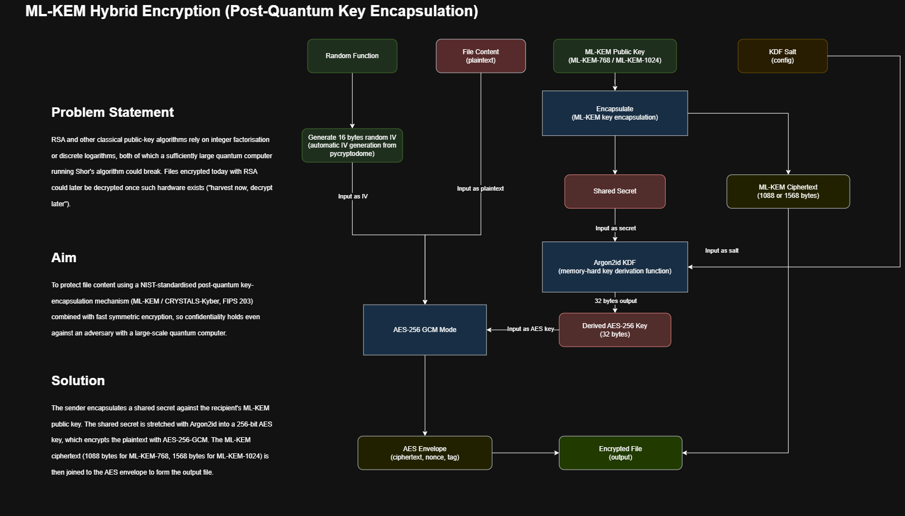
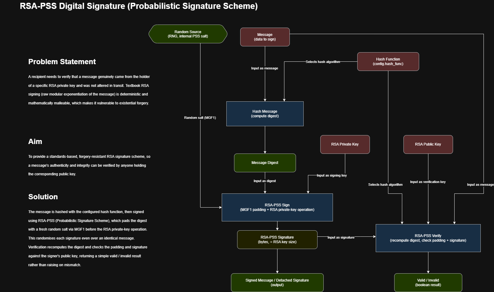
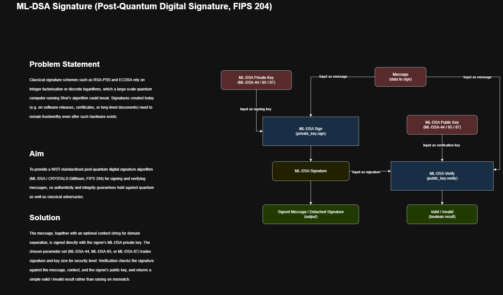
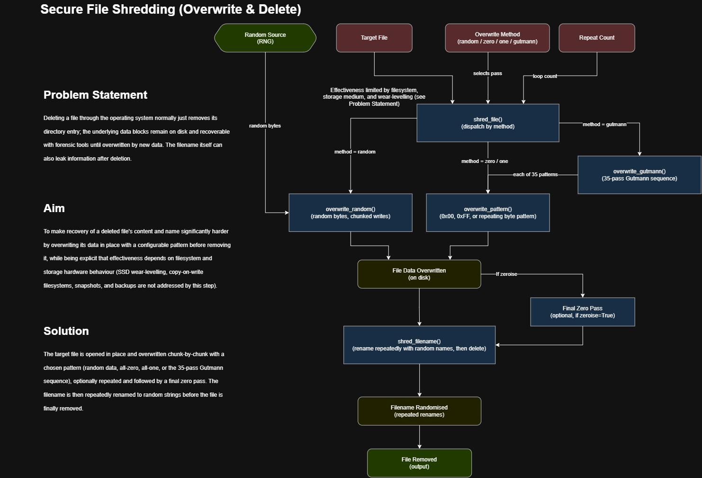

# AES Encryption

# RSA-OAEP Encryption (Direct RSA)

# Extended OAEP Encryption (Hybrid with AES-256)

# ML-KEM Encryption (Hybrid with KDF and AES-256)

# RSA-PSS Signatures

# ML-DSA Signatures

# File Shedding Diagram

